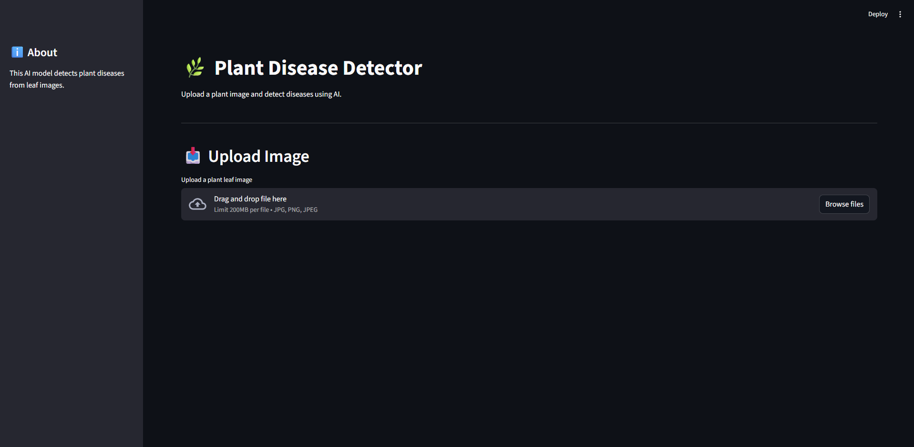
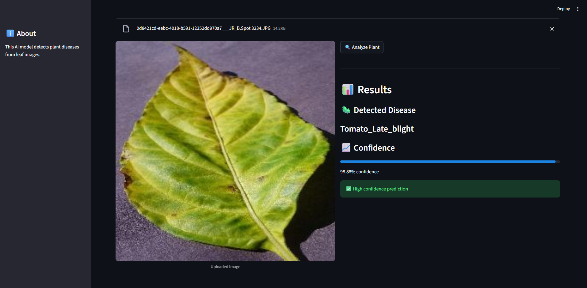

# 🌿 Plant Disease Detection App

An AI-powered web application that detects plant diseases from leaf images using **Deep Learning** and provides **confidence scores** and **treatment suggestions**.

---

## 🚀 Features

- 🌿 **Image Upload** – Upload plant leaf images
- 🤖 **AI Disease Detection** – Predicts plant diseases using a trained model
- 📊 **Confidence Score** – Shows how confident the model is
- 🖥️ **User-Friendly UI** – Interactive interface built with Streamlit

---

## 🖼️ Demo

 

```

---

## 🧠 How It Works

1. User uploads a plant leaf image
2. Image is preprocessed (resized, normalized)
3. The trained deep learning model analyzes the image
4. The system predicts:
   - Disease name
   - Confidence score

---

## 🛠️ Tech Stack

- **Python**
- **Streamlit**
- **TensorFlow / Keras**
- **NumPy**
- **Pillow (PIL)** for image processing

---

## 📂 Project Structure

```

plant-disease-app/
│
├── app.py
├── plant_disease_model # Trained model
├── config.py
├── predict.py
├── train.py
├── assets/
└── README.md

````

---

## ⚙️ Installation

1. Clone the repository:
2. Install dependencies:

---

## ▶️ Run the App

```bash
streamlit run app.py
````

---

## 📊 Example Output

- 🦠 Disease: **Tomato_Late_blight**
- 📈 Confidence: **87.45%**

---

## 💡 Future Improvements

- 📱 Mobile-friendly UI
- 📸 Real-time camera detection
- 💊 Treatment Suggestions for detected disease
- 🧠 Improved model accuracy with larger dataset
- ☁️ Deploy online (Streamlit Cloud / Hugging Face)

---

## 👤 Author

**Abdalmomen Mohammed Awad Mohammed**

---

## ⭐ Support

If you found this useful:

- Star ⭐ the repo
- Share feedback
- Suggest improvements

---
